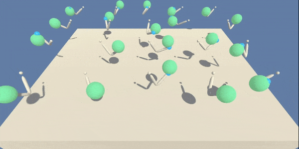

# Continuous Control

This is the second project of [Deep Reinforcement Learning Udacity Nanodegree Program](https://eu.udacity.com/course/deep-reinforcement-learning-nanodegree--nd893).

## Introduction to the Environment

<table class="unchanged rich-diff-level-one">
  <thead><tr>
      <th align="left">Version 1: Single Agent</th>
      <th align="left">Version 2: 20 Agents</th>
  </tr></thead>
  <tbody>
    <tr>
      <td align="left"></td>
      <td align="left"></td>
    </tr>
  </tbody>
</table>

In this environment, a double-jointed arm can move to target locations. A reward of `+0.1` is provided for each step that the agent's hand is in the goal location. Thus, the goal of the agent is to maintain its position at the target location for as many time steps as possible.

The observation space consists of `33` variables corresponding to **position**, **rotation**, **velocity**, and **angular velocities** of the arm.

Each action is a vector with `4` numbers, corresponding to torque applicable to two joints. Every entry in the action vector should be a number between `-1` and `1`.

The task is episodic, and in order to solve the environment, the agent, or each of 20 agents, must get an average score of +30 over 100 consecutive episodes, with each episode consisting of about 1000 time steps.

## Instructions

### 1. Setting up a Python environment

* Assuming that you have already installed either [Miniconda or Anaconda](https://www.anaconda.com/distribution/):\
please, follow the [instructions in the DRLND GitHub repository](https://github.com/udacity/deep-reinforcement-learning#dependencies) to set up your Python environment.

* You might need to install PyTorch separately [here](https://pytorch.org/get-started/locally/).

* Also, if you haven't yet, clone this repository and save it wherever you want!

### 2. Download the Unity Environment

You do __Not__ need to install Unity to run this code—the Udacity team has already built the environment for this project, and you can download it from one of the links below. There are two versions available: <u>**Single Agent**</u> and <u>**20 Agents**</u>. You need only select the environment that matches your operating system (the download will start right after you click the link):

- **_Version 1: Single Agent_**
    - Linux \[44.7 MB]: [click here](https://s3-us-west-1.amazonaws.com/udacity-drlnd/P2/Reacher/one_agent/Reacher_Linux.zip)
    - Mac OSX \[20.9 MB]: [click here](https://s3-us-west-1.amazonaws.com/udacity-drlnd/P2/Reacher/one_agent/Reacher.app.zip)
    - Windows (32-bit) \[15.7 MB]: [click here](https://s3-us-west-1.amazonaws.com/udacity-drlnd/P2/Reacher/one_agent/Reacher_Windows_x86.zip)
    - Windows (64-bit) \[18.1 MB]: [click here](https://s3-us-west-1.amazonaws.com/udacity-drlnd/P2/Reacher/one_agent/Reacher_Windows_x86_64.zip)

- **_Version 2: 20 Agents_**
    - Linux \[44.7 MB]: [click here](https://s3-us-west-1.amazonaws.com/udacity-drlnd/P2/Reacher/Reacher_Linux.zip)
    - Mac OSX \[20.9 MB]: [click here](https://s3-us-west-1.amazonaws.com/udacity-drlnd/P2/Reacher/Reacher.app.zip)
    - Windows (32-bit) \[15.7 MB]: [click here](https://s3-us-west-1.amazonaws.com/udacity-drlnd/P2/Reacher/Reacher_Windows_x86.zip)
    - Windows (64-bit) \[18.1 MB]: [click here](https://s3-us-west-1.amazonaws.com/udacity-drlnd/P2/Reacher/Reacher_Windows_x86_64.zip)

Then, extract the content folder in any location you want.

### 3. Run the Notebook!

By now, you should be all set to run my notebook!

Follow the instructions in the notebook and have fun!

* The first section loads the environment file and demonstrates the environment with an agent—or twenty of them depending on which version you are using—performing random moves. (When loading the environment file, you need to manually set the file path to the environment (e.g. `"/path/to/where/you/saved/the/environment/Reacher_Windows_x86_64/Reacher.exe"`))
* The second section includes training codes for training a smart agent. (This will take some time.)
* The next section after training loads a pre-trained smart agent and shows its performance!
