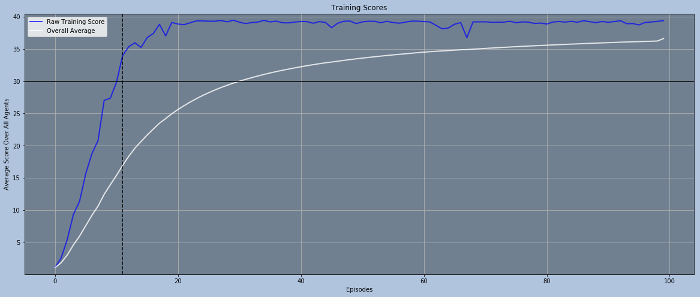
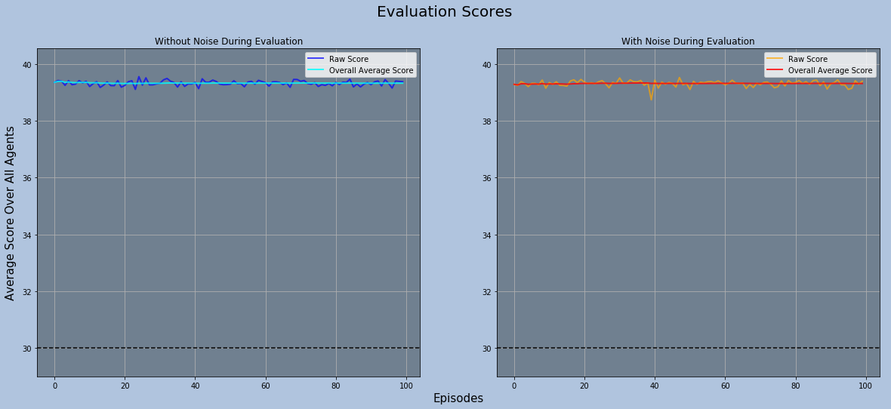
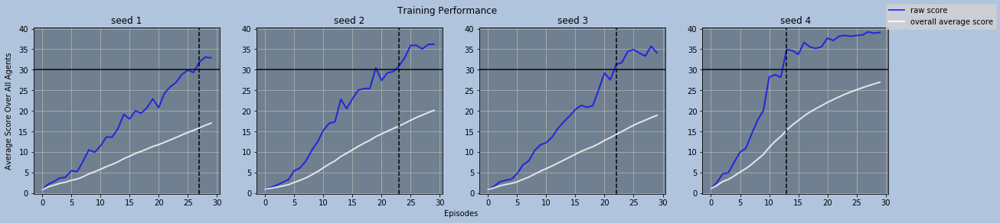
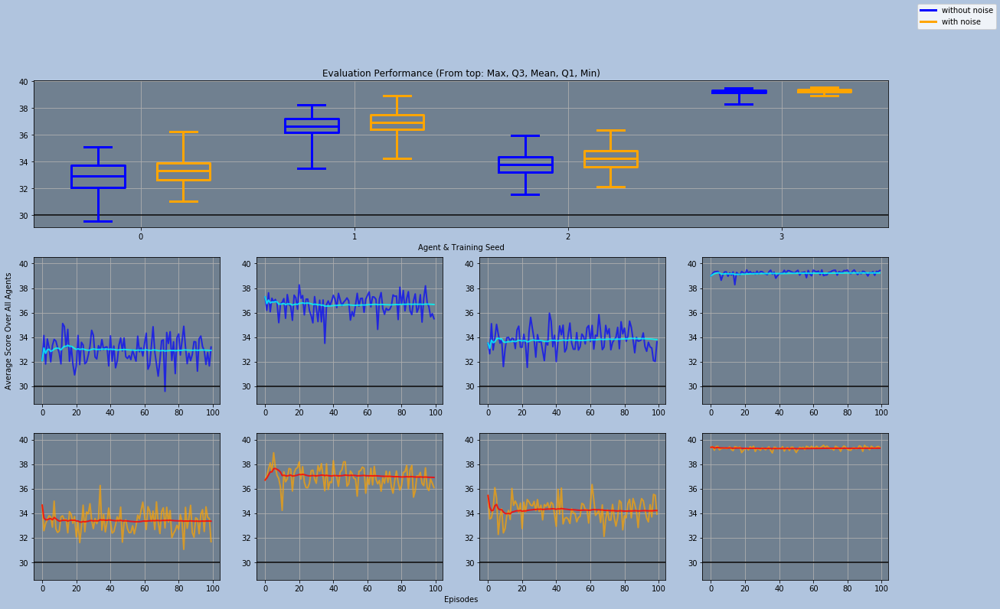

# Report of the Implementation & Performance

This report is made as a part of this project.

## Agent Algorithm

The algorithms for the agent implemented in `ddqn_agent.py`, `model.py`, and `replay_buffer.py` are [Deep Deterministic Policy Gradient](https://arxiv.org/abs/1509.02971) and [Distributional Deep Deterministic Policy Gradient](https://arxiv.org/abs/1804.08617).

Both implementation incorporate [Prioritized Experienced Replay](https://arxiv.org/abs/1511.05952), [Multi-step Bootstrap Targets](https://arxiv.org/abs/1602.01783), and [Noisy Networks](https://arxiv.org/abs/1706.10295). Each component comes with its own set of hyperparameters and setting certain parameters to certain values can disable the effects of the components.

The overall algorithm works like this:<br/>
1. The agent receives the current state.
2. The actor network takes in the state and outputs an action.
3. The agent takes the action and receives an reward, the next state, and a boolean value indicating whether the agent reached the terminal state.
4. The experience tuple `(state, action, reward, next state, terminal reached)` is passed to the replay buffer and stored in a temporal buffer.
5. If enough consecutive experience tuples are gathered in the temporal buffer, this buffer is copied and added to the main replay buffer with a maximum priority value.
6. Every `k` time steps, specified as a hyperparameter, randomly sample a batch of experiences with probabilities based on their priorities, take a learning step, and update the priorities according to the losses calculated during the learning step.
7. Repeat these steps until the training is finished.

During the learning step, the target actor and critic networks, separate from online networks, are used to calculate the expected target Q-value or the distribution of target Q-value. This target value or distribution is then used to update the online critic network to bring its estimates closer to the target value or distribution (using TD-error for scalar Q-values or Kullback-Leibler divergence for distributions). The losses calculated during this update is also used as updated priorities for each corresponding experience. After updating the online critic network, the online actor network is updated so that the actor network outputs actions with higher expected Q-value according to the updated online critic network.

`ReplayBuffer` contains a single main memory buffer and one additional temporal buffer per agent for n-step bootstrap learning. Before the memories are fed into the main buffer, they are first stored in the corresponding temporal buffers, which are deque objects with `n_multisteps` length limits. Each temporal buffer is iterated and fed into the main memory when they are full, and they are emptied whenever the corresponding agent finishes the current episode.

Most part of the implementation is from [my Rainbow implementation used in the previous project](https://github.com/wytyang00/Udacity-DRL-Nanodegree-Navigation-Project). The overall structures for the `ReplayBuffer` and `Agent` are very similar, and the `NoisyLinear` is used as it is.

The critic model contains both scalar and distributional network architectures, and which architecture to be used is determined via the hyperparameters `distributional`.

There are two types of noise available: parameter space noise through noisy linear layers, and gaussian noise on the action space. The standard deviation of the gaussian noise is controlled by `eps` training parameters. Ornstein-Uhlenbeck noise is a popular and effective noise for continuous control tasks like this, but I have only implemented gaussian noise as I was following the methods used in [Distributional Deep Deterministic Policy Gradient](https://arxiv.org/abs/1804.08617).

For [my previous project](https://github.com/wytyang00/Udacity-DRL-Nanodegree-Navigation-Project), I wasn't especially interested in implementing the "Sum Tree" algorithm for efficient sampling as described in [Prioritized Experienced Replay](https://arxiv.org/abs/1511.05952) since I was too caught up in making the whole algorithm working. However, this time, the time cost for training was a huge issue, taking several days for training an agent, which made it hard for me to fiddle with the hyperparameters. So, I have implemented the "Sum Tree" algorithm using NumPy arrays and vectorized operations, and incorporated it in the `ReplayBuffer`. This kept the sampling and updating costs low and constant, significantly boosting the training speed.

## Hyperparameters

Most of the avalilable hyperparameters are similar to the ones I had in the [previous project](https://github.com/wytyang00/Udacity-DRL-Nanodegree-Navigation-Project), but a few hyperparameters, such as `eps`, have slightly different effects and there are also some additional hyperparameters added. I ran several training sessions with different hyperparameter settings and settled with these values using **20-Agents version**:

```python
hyperparams = {
    # Reproducibility
    'seed'                : 0,        # random seed for reproducible results

    # Agent basic parameters
    'batch_size'          : 256,      # batch size for each learning step
    'buffer_size'         : int(1e6), # up to how many recent experiences to keep
    'start_since'         : 256,      # how many experiences to collect before starting learning
    'gamma'               : 0.99,     # discount factor
    'update_every'        : 1,        # update step frequency
    'n_updates'           : 10,       # number of updates per update step
    'tau'                 : 1e-3,     # soft-update parameter [0, 1]

    'actor_lr'            : 5e-4,     # learning rate for the actor network
    'critic_lr'           : 5e-4,     # learning rate for the critic network
    'clip'                : 1,        # gradient clipping to prevent gradient spikes
    'weight_decay'        : 0,        # weight decay for the *critic* network

    'distributional'      : True,     # whether to use distributional learning

    # Prioritized Experience Replay Parameters
    'priority_eps'        : 1e-3,     # base priority in order to ensure nonzero priorities
    'a'                   : 1.,       # priority exponent parameter [0, 1]

    # n-step Bootstrap Target parameter
    'n_multisteps'        : 4,        # number of steps to bootstrap
    'separate_experiences': False,    # whether to store experiences with no overlap

    # Distributional Learning parameters
    'v_min'               : 0,        # minimum value for support
    'v_max'               : 10,       # maximum value for support
    'n_atoms'             : 51,       # number of atoms for distribution

    # Noisy Layer parameters
    'initial_sigma'       : 0.050,    # initial noisy parameter value
    'linear_type'         : 'noisy',  # either 'linear' or 'noisy'
    'factorized'          : False     # whether to use factorized gaussian noise or not(independent gaussian noise)
}

train_params = {
    'n_episodes'           : 200,   # number of total episodes to train
    'continue_after_solved': False, # whether to keep training after the environment is solved

    # Exploration using gaussian noise
    'eps_start'            : 0.0,   # initial epsilon value
    'eps_min'              : 0.0,   # minimum value for epsilon
    'eps_decay'            : 0.0,   # epsilon decay rate

    # Importance-Sampling Weight parameter for Prioritized Experience Replay
    'beta_start'           : 1.,   # starting value
    'beta_end'             : 1.    # end value
}
```

<br/>
The architecture of the Actor Network is as follows:
<table class="unchanged rich-diff-level-one">
  <tr>
    <td align="center"><code>States</code><br/>>>><br/>Input (, [<code>batch_size</code>, <code>state_size</code>])</td>
  </tr>
  <tr>
    <td align="center">NoisyLinear ([<code>batch_size</code>, <code>state_size</code>], [<code>batch_size</code>, 256])</td>
  </tr>
  <tr>
    <td align="center">ELU(alpha=1.0)</td>
  </tr>
  <tr>
    <td align="center">NoisyLinear ([<code>batch_size</code>, 256], [<code>batch_size</code>, 128])</td>
  </tr>
  <tr>
    <td align="center">ELU(alpha=1.0)</td>
  </tr>
  <tr>
    <td align="center">NoisyLinear ([<code>batch_size</code>, 128], [<code>batch_size</code>, <code>action_size</code>])</td>
  </tr>
  <tr>
    <td align="center">Tanh()</td>
  </tr>
  <tr>
    <td align="center">Output (, [<code>batch_size</code>, <code>actions_size</code>])<br/>>>><br/><code>Actions</code></td>
  </tr>
</table>

<br/>
And the architecture of the Critic Network is as follows:
<table class="unchanged rich-diff-level-one">
  <tr>
    <td align="center" colspan="1"><code>States</code><br/>>>><br/>Input (, [<code>batch_size</code>, <code>state_size</code>])</td>
    <td align="center" colspan="1"></td>
  </tr>
  <tr>
    <td align="center" colspan="1">Linear ([<code>batch_size</code>, <code>state_size</code>],<br/>[<code>batch_size</code>, 256])</td>
    <td align="center" colspan="1"></td>
  </tr>
  <tr>
    <td align="center" colspan="1">ELU(alpha=1.0)</td>
    <td align="center" colspan="1"><code>Actions</code><br/>>>><br/>Input (, [<code>batch_size</code>, <code>action_size</code>])</td>
  </tr>
  <tr>
    <td align="center" colspan="2">Concatenate ({[<code>batch_size</code>, 256], [<code>batch_size</code>, <code>action_size</code>]}, [<code>batch_size</code>, 256 + <code>action_size</code>])</td>
  </tr>
  <tr>
    <td align="center" colspan="2">Linear ([<code>batch_size</code>, 256 + <code>action_size</code>], [<code>batch_size</code>, 128])</td>
  </tr>
  <tr>
    <td align="center" colspan="2">ELU(alpha=1.0)</td>
  </tr>
  <tr>
    <td align="center" colspan="2">Linear ([<code>batch_size</code>, 128], [<code>batch_size</code>, 128])</td>
  </tr>
  <tr>
    <td align="center" colspan="2">ELU(alpha=1.0)</td>
  </tr>
  <tr>
    <td align="center" colspan="2">Linear ([<code>batch_size</code>, 128], [<code>batch_size</code>, <code>n_atoms</code> <b>or</b> 1])</td>
  </tr>
  <tr>
    <td align="center" colspan="2">Output (, [<code>batch_size</code>, <code>n_atoms</code>] <b>or</b> 1)<br/>>>><br/><code>Estimate Q-value Expectations</code> <b>or</b> <code>Probability Distributions</code> for the <code>Actions</code> given</td>
  </tr>
</table>

## Training & Evaluation Results

An agent with the hyperparameters described above solved the environment with the minimum number of episodes: **100 episodes**.



In fact, as shown in this plot, the agent already reached a solving-performance around **episode 12**, never scoring lower than `+30` from that point. The weights for the agent's actor and critic networks are saved in `pretrained.pth`.

In order to get a better estimate for the agent's end performance, I ran two evaluation runs, one with noise and one without, each running for 100 episodes:



Although not obvious, the agent performed slightly better with more stability when the noise was removed. This is interesting since most of other models I had trained before tended to score better with noise.

Previous to this agent, I had trained four agents with almost identical hyperparameter settings, but with different seeds, ReLU as hidden activations, and only for 30 episodes. I had to discard them for this project after getting a notification that I was expected to train the agents for at least 100 episodes and use the training scores to determine their performances. Here are the training and evaluation plots for those four previous agents:





Again, these models performed better with noise, as it appears on the bottom plot. This would be an interesting topic to look into with more details later.

## Future Ideas

The current performance of the agent is already quite satisfying, but I have not tried any on-policy algorithm such as PPO or A2C. I would be interested in trying those out and see if I can get an even better performance.

Also, I want to try using Q-Prop, an algorithm that combines both off-policy learning and on-policy learning, and compare it with all others as well.

Additionally, I noticed that some others have used batch normalization in their models. I'm curious whether adding a batch normalization would improve my current model even further or not.
